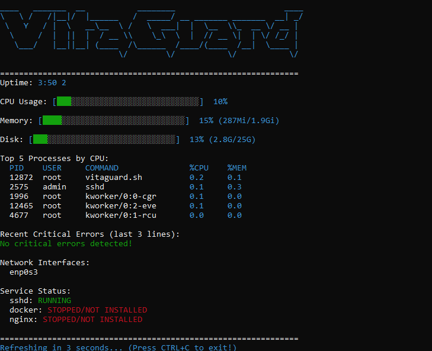

# 🛡️ VitaGuard
Quickly monitor your Linux server's vital signs straight from the terminal

## 🛠️ Technologies
- Bash scripting
- Core Linux tools: `top, free, df, ps, grep, awk, tail`

## 🚀 Features
- Real-time updates (refreshes every 5 seconds)
- Color-coded progress bars for CPU, memory, disk
- Uptime and load average
- Top 5 processes by CPU usage (clean table)
- Recent critical errors from syslog (filtered, max 3 lines)
- Awesome ASCII art header

## 💡 Why I built it
This script was created to practice my Linux administration and Bash scripting skills:
- Creating visual progress bars and color alerts
- Filtering log noise for useful error reporting
- Making something truly practical that anyone can pick up and run with ease

## 🔍 How it works
The script runs in an infinite loop that:
- Clears the terminal screen
- Collects system metrics using standard Linux utilities
- Renders color-coded progress bars and warnings
- Displays process, log and service information
- Sleeps for 5 seconds before refreshing

## ⚠️ Requirements & Tips
- Bash
- Linux system with standard core utilities
- Tested on Ubuntu 24.04 (expected to work on most Debian-based distributions)

> Tip: Run in a dedicated terminal, it refreshes automatically!

## 📦 Usage
1. Clone the repository
2. Make the script executable: `chmod +x vitaguard.sh`
3. Run the script (may need sudo): `./vitaguard.sh`
4. Watch the stats update, press `CTRL+C` to exit

## 🔮 Planned Improvements
- Configurable refresh interval
- Optional non-interactive / one-shot mode
- Improved compatibility across Linux distributions
- Optional HTML/JS web dashboard for remote monitoring
